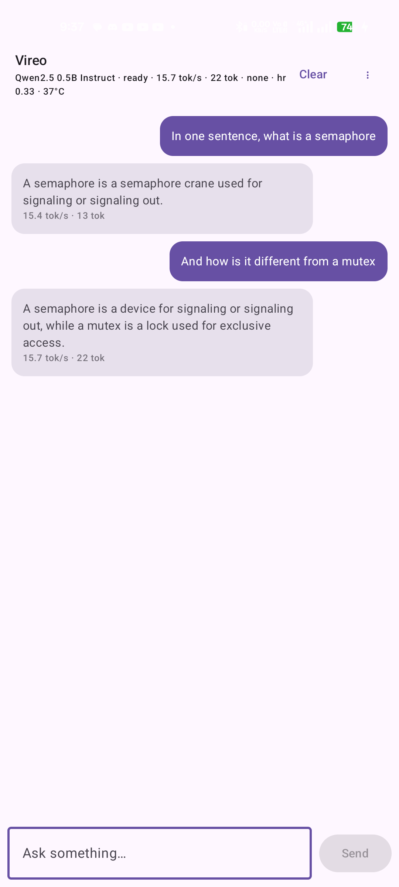
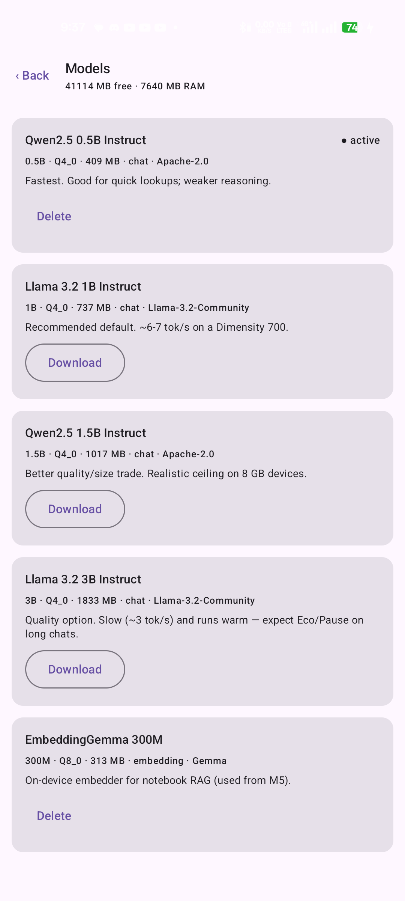
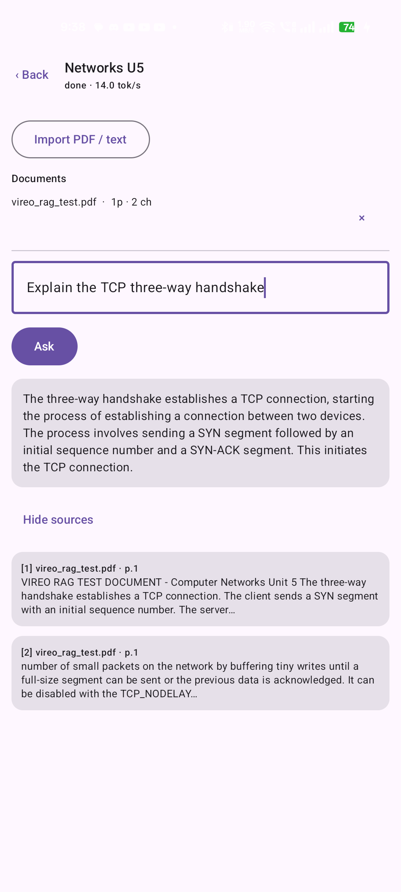
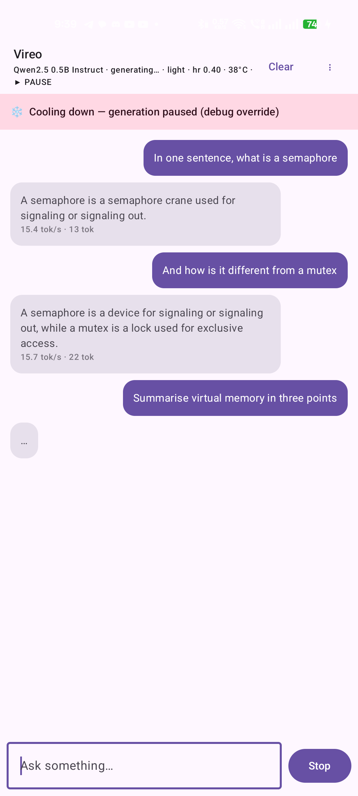
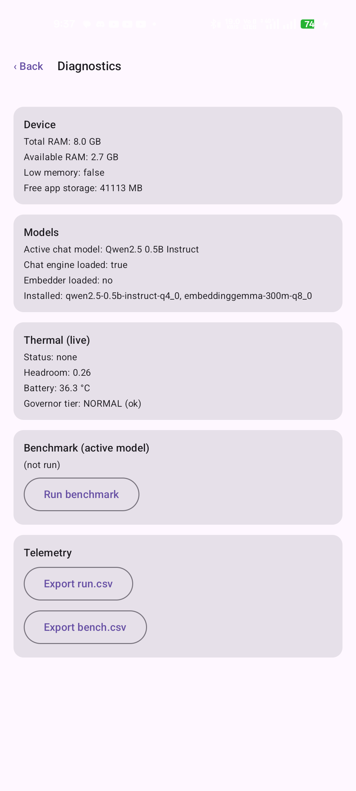
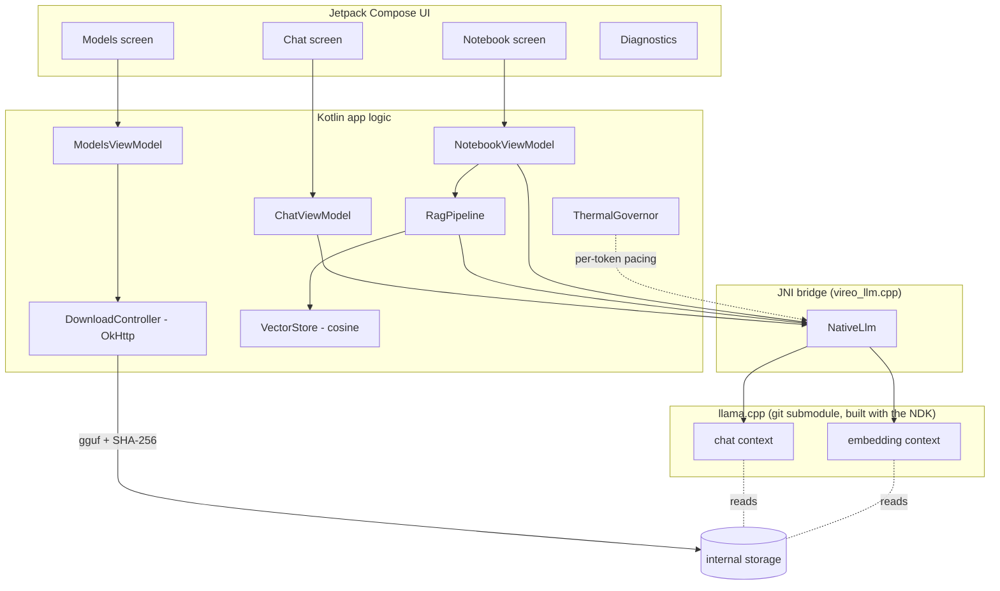

# Vireo — an offline, on‑device AI study assistant for Android

Vireo runs a large‑language model **entirely on the phone** — no internet, no cloud API, no
Android Studio. You download a small language model *inside the app*, then chat with it or
ask questions against your own PDFs and notes, all with the network off. A built‑in thermal
governor keeps the phone from overheating during inference.

Built for a B.Tech (CSE‑AIML) major project, **Stage‑I**. Target hardware is a mid‑range
2023 phone (realme narzo 60 5G, MediaTek Dimensity 700).

|  |  |
|---|---|
| **Release APK** | **15.5 MB** — the whole llama.cpp engine, *no model bundled* |
| **Runtime** | 100 % offline after a one‑time model download |
| **Models** | downloaded in‑app, SHA‑256 verified, deletable (0.5B–3B GGUF) |
| **Speed** | ~6–7 tok/s (Llama‑3.2‑1B) / ~13–15 tok/s (Qwen2.5‑0.5B) on a Dimensity 700 |
| **Heat** | held ~36–37 °C across all testing; auto‑throttles then pauses under load |
| **Toolchain** | headless Gradle + Android NDK — **Android Studio never used** |

---

## What it does

| Feature | Screenshot |
|---|---|
| **Offline chat** — streamed, multi‑turn, history saved on device. The top bar shows live tok/s + thermal status. |  |
| **In‑app model manager** — a curated catalog; download / activate / delete GGUF models with a resumable, hash‑verified downloader. The APK ships **no model**. |  |
| **Notebook RAG** — import a PDF / TXT / MD file, ask a question, get a grounded answer whose **citations are computed from the retrieved text** (file + page), not parsed from the model. |  |
| **Thermal governor** — reads the OS thermal signals and battery temperature; slows generation (eco) then pauses it (keeping the KV cache) and auto‑resumes when the phone cools. |  |
| **Diagnostics** — device RAM / storage, model + embedder state, a live thermal readout, an on‑device benchmark, and CSV export of the telemetry log. |  |

---

## How it works (one picture)



*Chat and the RAG embedder are two separate llama.cpp contexts that stay resident together
(they fit in RAM on an 8 GB phone). See [`docs/ARCHITECTURE.md`](docs/ARCHITECTURE.md) for
the data‑flow diagrams.*

---

## Quick start (no Android Studio)

You need the Android **command‑line tools**, **platform‑tools**, **NDK** and **CMake** — all
installable with `sdkmanager`, plus a JDK 17+. Full steps in
[`docs/BUILD.md`](docs/BUILD.md). Then:

```bash
git clone --recurse-submodules https://github.com/kareem1207/vireo-android
cd vireo-android

# point at your SDK
echo "sdk.dir=/absolute/path/to/Android/Sdk" > local.properties

./gradlew :app:assembleRelease
adb install -r app/build/outputs/apk/release/app-release.apk
```

Open the app → **⋮ → Models** → download *Llama 3.2 1B Instruct* (~737 MB, one time) →
**Activate** → turn Wi‑Fi off → chat. For RAG, also download *EmbeddingGemma 300M*, then
**⋮ → Notebooks → New**, import a file, and ask.

---

## Repository layout

```
app/src/main/
  cpp/                      CMakeLists.txt + vireo_llm.cpp  (the JNI ↔ llama.cpp bridge)
  java/com/vireo/
    llm/                    NativeLlm, LlmEngine, TokenPacer          (inference)
    thermal/                ThermalGovernor, ThermalPacer, Telemetry  (heat control)
    models/                 ModelCatalog, ModelDownloader, InstalledModels, Models UI
    rag/                    Embedder, DocExtractor, Chunker, VectorStore, RagPipeline
    notebook/               NotebookViewModel + Notebook UI
    chat/                   ChatViewModel + Chat UI
    diag/                   DiagnosticsScreen + Benchmark
  assets/model_catalog.json curated model list (id, size, SHA-256, URL, min RAM, licence)
third_party/llama.cpp/      git submodule, pinned
docs/                       ARCHITECTURE · METHODOLOGY · BUILD · RESULTS  (+ images/)
```

## Tech stack

Kotlin · Jetpack Compose (Material 3) · Coroutines/Flow · `minSdk 28`, `targetSdk 35`,
**arm64‑v8a only** · [llama.cpp](https://github.com/ggml-org/llama.cpp) via a ~250‑line JNI
layer · OkHttp (downloads) · PdfBox‑Android (PDF text) · no Room / no DI framework
(file‑backed persistence). Toolchain: NDK r27, CMake 3.22.1, Gradle 8.10.2, AGP 8.7.3,
JDK 21. **No Android Studio.**

## Status

All six Stage‑I milestones are implemented and verified on the target device — see
[`docs/RESULTS.md`](docs/RESULTS.md) for the measurements and per‑feature evidence, and
[`docs/METHODOLOGY.md`](docs/METHODOLOGY.md) for the design decisions and the bugs found
along the way.

## Licence & credits

Project code: MIT (see `LICENSE`). Bundled/downloaded components keep their own licences —
llama.cpp (MIT), Qwen2.5 (Apache‑2.0), Llama 3.2 (Llama Community Licence), EmbeddingGemma
(Gemma Terms). Models are pulled from Hugging Face on the user's request; none are
redistributed in this repository.
