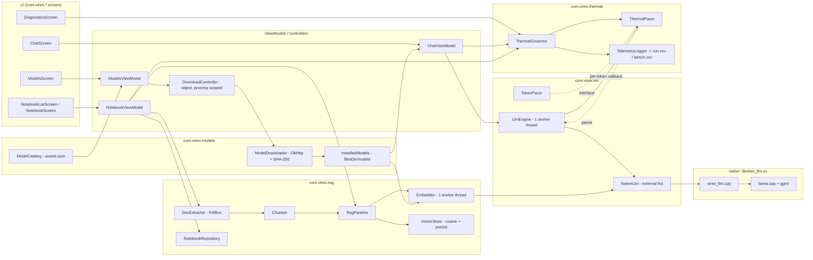
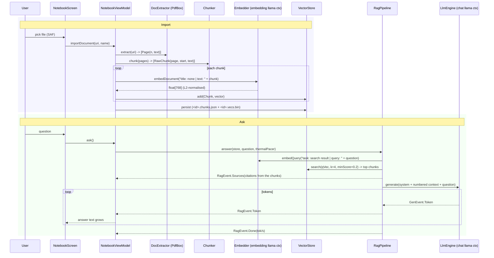
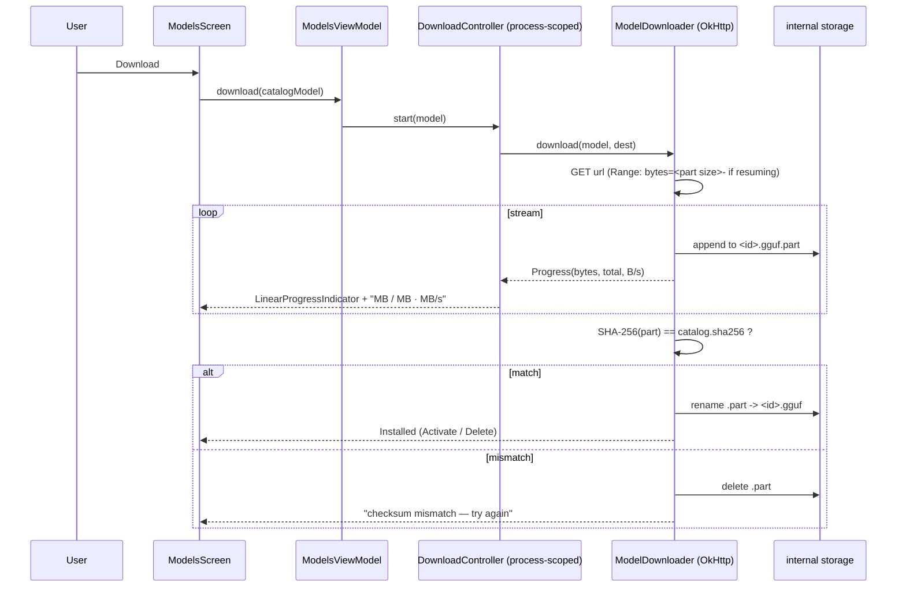

# Architecture

Vireo is a single‑Activity Jetpack Compose app. All state is held in `ViewModel`s;
persistence is plain files (JSON + a small binary vector file) — no Room, no DI framework.
The only native code is a ~250‑line JNI bridge over **llama.cpp**, which is a pinned git
submodule compiled by the Android **NDK** at build time.

## Component map



### The JNI boundary

`NativeLlm` (Kotlin `object`) declares `external` functions; `vireo_llm.cpp` implements the
matching `Java_com_vireo_llm_NativeLlm_*` symbols. Symbols are linked **by name**, so R8
must not rename `NativeLlm` — `proguard-rules.pro` keeps it and the `GenerationCallback`
interface (whose `onToken` / `onDone` the C++ calls back by name).

| Native function | Purpose |
|---|---|
| `nativeLoadModel(path, nCtx, nThreads, nBatch, embeddings)` → handle | opens a llama.cpp model + context; `embeddings != 0` sets `cp.embeddings`, `pooling_type = MEAN`, `n_ubatch = n_batch` |
| `nativeGenerate(handle, roles[], contents[], params…, callback)` | applies the model's chat template to the message list, decodes the prompt **in `n_batch` chunks**, then samples + streams tokens via `callback.onToken`; ends with `callback.onDone(tokPerSec, n, promptEvalTokPerSec)` |
| `nativeEmbed(handle, text)` → `float[]` | tokenises, one `llama_decode`, mean‑pooled vector from `llama_get_embeddings_seq`, L2‑normalised |
| `nativeCancel(handle)` / `nativeFree(handle)` | atomic cancel flag / free context + model |

Two contexts exist at once: the **chat** model (`LlmEngine`, its own worker thread) and the
**embedding** model (`Embedder`, its own worker thread). On an 8 GB device a 0.8 GB chat
model + a 0.35 GB embedder coexist without OOM.

---

## Data flow — chat turn

```mermaid
sequenceDiagram
    participant U as User
    participant CS as ChatScreen
    participant VM as ChatViewModel
    participant GOV as ThermalGovernor
    participant PACE as ThermalPacer
    participant ENG as LlmEngine (worker thread)
    participant NAT as vireo_llm.cpp / llama.cpp

    U->>CS: type + Send
    CS->>VM: send(text)
    VM->>VM: append user msg + empty assistant msg; save history
    VM->>ENG: generate(system + last 8 msgs, params, pacer)
    ENG->>NAT: nativeGenerate(...)
    NAT->>NAT: apply chat template, tokenize, decode prompt in n_batch chunks
    loop each generated token
        NAT->>PACE: onToken(piece)  (runs on the native thread)
        PACE->>GOV: read snapshot.tier
        alt tier == ECO
            PACE-->>NAT: sleep 30 ms, then return true
        else tier == PAUSE
            PACE-->>NAT: spin (300 ms) until tier clears
        else NORMAL
            PACE-->>NAT: return true immediately
        end
        NAT-->>ENG: emit GenEvent.Token
        ENG-->>VM: Flow<GenEvent>
        VM-->>CS: state.messages updated (Compose recomposes)
    end
    NAT->>VM: onDone(tok/s)
    VM->>VM: finalise message + stats; save history; telemetry row
```

## Data flow — notebook ingest & question



## Data flow — model download



## Persistence (all under `filesDir/`)

| Path | Written by | Contents |
|---|---|---|
| `models/<id>.gguf` | `ModelDownloader` | downloaded, SHA‑256‑verified model weights |
| `chat_history.json` | `ChatRepository` | chat turns (role, text, stats) |
| `notebooks/notebooks.json` | `NotebookRepository` | notebook list |
| `notebooks/<id>.docs.json` | `NotebookRepository` | per‑document metadata (name, pages, chunk count) |
| `notebooks/<id>.chunks.json` | `VectorStore` | chunk text + `{docId, page, charStart}` |
| `notebooks/<id>.vecs.bin` | `VectorStore` | `int32 count`, `int32 dim`, then `count*dim` float32 |
| `telemetry/run.csv` | `TelemetryLogger` | `ts,event,gen_tok_s,status,headroom,battery_c,threads,tier,reason` |
| `telemetry/bench.csv` | `TelemetryLogger` | one row per benchmark run |

## Threading

- **Main / Compose** — UI + `ViewModel` state.
- **`vireo-llm`** — one dedicated thread; the chat `LlmEngine` never touches native code
  concurrently. `nativeGenerate` blocks this thread for the whole turn; the `ThermalPacer`
  running inside its per‑token callback is *why* blocking there throttles/pauses generation.
- **`vireo-embed`** — one dedicated thread for the embedding context.
- **`vireo-thermal`** — a `ScheduledExecutorService` polling thermal signals every 2 s.
- **`DownloadController` scope** — `SupervisorJob + Dispatchers.Default`, process‑lifetime.
